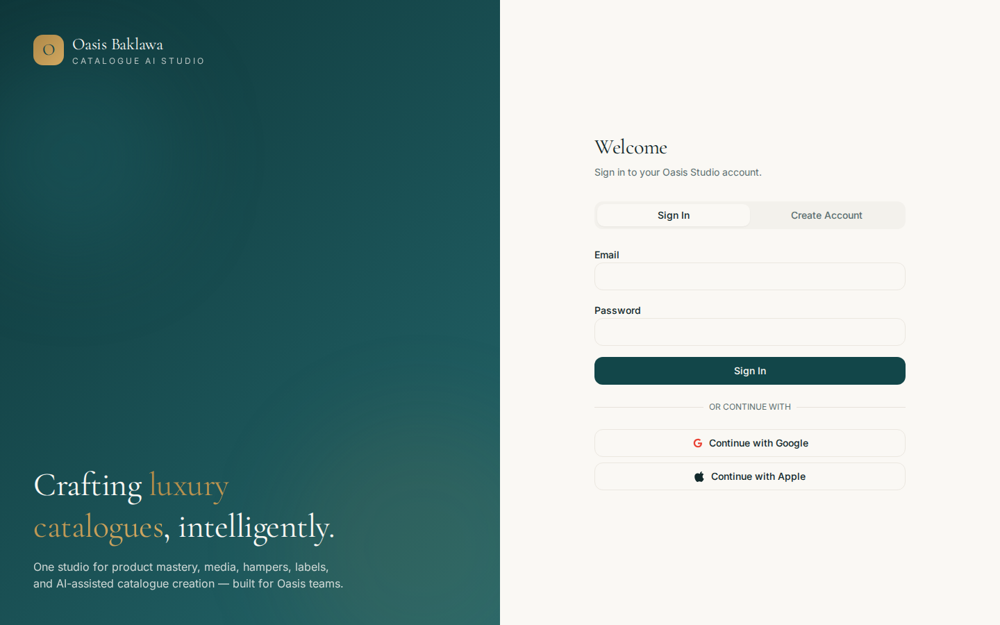
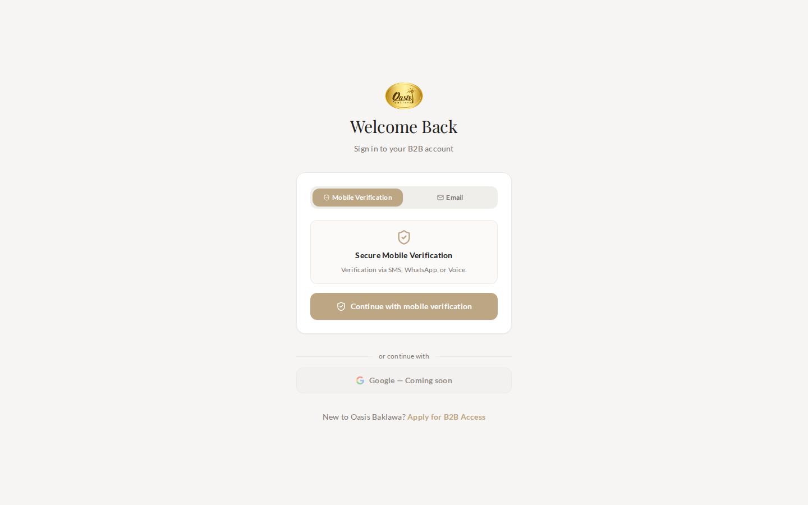

# Product Authoring UX Audit

**Date:** 2026-03-13  
**Method:** Playwright (`npm run test:product-authoring-audit`) + static code-path analysis  
**Apps compared:**

| System | Production URL | Create route |
|--------|----------------|--------------|
| **Central** | https://cursor-central-vercel.vercel.app | `/admin/products` → **Add New Product** (slide-out panel) |
| **AI Studio** | https://oasis-ai-studio.vercel.app | `/products` → **New Product** → `/products/new` (full-page editor) |

**Artifacts:** `audit-artifacts/product-authoring/` (screenshots, `metrics.json`, Playwright report)

---

## Executive summary

| Finding | Central | AI Studio |
|---------|---------|-----------|
| **Fastest path to a valid save** | **Wins** — 3 clicks, ~5 manual fields (with defaults) | Slower — ~11 clicks, ~8+ manual fields (SKU builder + tabs) |
| **Richest product model** | Operational essentials in one panel | **Wins** — 72-field authority model, contributor drafts, structured SKU |
| **AI assistance (wired)** | **Wins** — HSN/GST/allergens/ingredients + alias LLM | Partial — SKU RPC + heuristic aliases; `ComplianceAiPanel` **not wired** |
| **Defaults / auto-fill** | **Wins** — HSN, GST, shelf life, UOM, MOQ, category | Sparse — mostly booleans + `currency: INR` |
| **Duplicate data entry risk** | High if both systems used without sync | High — same `products` table, different field shapes |
| **Live timed metrics** | Gate only (no test credentials) | Gate only (no test credentials) |

**Recommendation:** Treat **AI Studio as authority plane** (SKU, compliance depth, drafts) and **Central as operational plane** (fast activation, pricing, routing). Bridge them with shared defaults, one-click “open in Studio”, and wired compliance AI on both sides.

---

## Methodology

### Playwright (live)

```bash
npm run test:product-authoring-audit
```

| Env var | Purpose |
|---------|---------|
| `TEST_STUDIO_EMAIL` / `TEST_STUDIO_PASSWORD` | AI Studio authenticated dry-run |
| `TEST_CENTRAL_EMAIL` / `TEST_CENTRAL_PASSWORD` | Central authenticated dry-run |
| `PRODUCT_AUTHORING_SAVE=1` | Persist product (off by default — production-safe) |

**Measured live (2026-03-13):**

| Metric | AI Studio | Central |
|--------|-----------|---------|
| Auth gate redirect | `/products` → `/auth` (~2.3s) | `/admin/products` → `/login` (~2.4s) |
| Clicks (gate) | 0 | 0 |
| Manual fields (gate) | 0 | 0 |
| Authenticated create flow | Skipped — no credentials | Skipped — no credentials |

### Reference path (code-derived)

Static analysis of `AdminProducts.tsx` (Central) and `ProductEdit.tsx` (AI Studio). Estimates assume **admin/owner** role and **production-safe dry-run** (fill minimal required fields, stop before save).

Full machine-readable output: `audit-artifacts/product-authoring/metrics.json` → `referencePath`.

---

## Screenshots

### AI Studio — auth gate




### Central — login gate



> Re-run with `TEST_*` credentials to capture authenticated list + form screenshots (`03-*`, `04-*`, `05-*`).

---

## Workflow comparison

### Central — create product

```
/admin/products
  └─ [Add New Product]  (1 click)
       └─ Slide-out panel — 6 scroll sections (no tabs)
            1. Identity & visuals + department
            2. Commercials & logistics + settlement unit
            3. Private label (conditional)
            4. Food compliance + AI attribute generator
            5. Product variants
            6. Intelligence & search (aliases + unit math)
       └─ [Save Product]  (1 click)
```

**`EMPTY_FORM` defaults (12 pre-filled):** category (first option), `storage_type: ambient`, `shelf_life: 90`, `hsn_code: 19059090`, `gst_percentage: 18`, `dietary_tags: ["100% Eggless"]`, `uom: Kg`, `settlement_unit: KG`, `moq: 1`, `is_active: true`, `visible_in_catalog: true`, `product_family: bulk_sweets`.

**Minimum save validation (admin):**

- `name`, `wholesale_price`, `production_department`
- If **active:** `hsn_code`, `gst_percentage` (already defaulted)
- If **active + KG settlement + food family:** `grams_per_piece`, `weight_per_box_kg`

**Wired AI:**

- ⚡ Generate AI Details → `generate-product-attributes` (HSN, GST, allergens, ingredients)
- ✨ Generate AI Aliases → `oasis-ai-chat`
- Nutrition placeholder template (manual QA)
- Description generator → **stub** (toast only)

---

### AI Studio — create product

```
/products
  └─ [New Product]  (1 click)
       └─ /products/new — tabbed editor (up to 12 tabs, class-dependent)
            Identity | UOM/MOQ | Media | Private label | Customisation |
            Dimensions | Frozen | BOM | Channels | Compliance | Ops | Product truth
       └─ SkuBuilder: 4 code selects + [Generate SKU]  (5+ clicks)
       └─ [Save] / [Submit draft]  (contributor path)
```

**`empty` defaults (4):** `currency: INR`, `is_active: true`, `is_catalogue_ready: false`, `sku_locked: true`.

**Minimum save validation (admin):**

- `product_name`, `product_class`, `sku`, `main_department`
- `production_department` when `main_department === ready_goods_store`
- `product_type` **or** `category` (one required)

**Contributor path (lighter):** `product_name`, `product_class`, `product_type` or `category` only — draft via `submitCatalogueDraft`.

**AI / automation (actual):**

- `generate_oasis_sku` RPC (SkuBuilder) — **wired**
- AliasManager “Generate basic” — **heuristic seed rules**, not LLM
- `ComplianceAiPanel` — **exists, not imported in ProductEdit**

---

## Measured & estimated metrics

| Metric | Central (reference) | AI Studio (reference) | Notes |
|--------|---------------------|------------------------|-------|
| **Click count (min viable)** | **~3** | ~11 | Studio: New + 4 SKU codes + Generate + tab hops + Save |
| **Click count (typical)** | ~6–8 | ~18–25 | Scrolling, toggles, media, compliance |
| **Manual fields (min)** | **~5** | ~8 | Studio SKU chain counts as 4+ fields |
| **Manual fields (typical)** | ~12 | ~18 | Full commercial + compliance |
| **Pre-filled on open** | **12 defaults** | 4 defaults | Central HSN/GST gap is largest UX delta |
| **Visible form controls** | ~47 | ~72 | Studio grows with product class |
| **Tab / section navigations** | 0 (scroll) | 3–8 tabs | Cognitive load vs scroll fatigue |
| **Time to form ready** | ~2–4s (est.) | ~2–5s (est.) | Live gate: ~2.3s both apps |
| **Time to min fill** | ~45–90s (est.) | ~2–4 min (est.) | Needs authenticated re-run to confirm |

---

## Friction analysis

### Automation opportunities

| Opportunity | Central | AI Studio | Priority |
|-------------|---------|-----------|----------|
| Wire compliance AI on save path | ✅ Partial | ❌ Panel unwired | **P0** |
| HSN/GST defaults by category | ✅ Defaulted | ❌ Empty | **P0** |
| LLM alias suggestions | ✅ `oasis-ai-chat` | Heuristic only | P1 |
| Auto SKU from class/category | Manual text SKU | RPC builder | Studio wins; expose in Central |
| Import from Category-1 CSV | N/A | Staging exists | P1 — link from New Product |
| Clone from similar product | Edit only | Edit only | P1 both |
| Description generation | Stub | None | P2 |

### Duplicate data entry

Both apps write to the shared `products` table with overlapping but differently named fields:

| Concept | Central field | AI Studio field | Risk |
|---------|---------------|-----------------|------|
| Name | `name` | `product_name` | Sync mapping required |
| Category | `category` (enum select) | `category` (free text) + `product_class` | **Schema drift** |
| Price | `wholesale_price` | `b2b_price` | Double entry |
| HSN/GST | defaulted | manual | Studio slower, error-prone |
| Image | `image_url` | `hero_image_url` | Recently synced in Studio; Central separate bucket |
| Department | `production_department` | `main_department` + `production_department` | Split model in Studio |

### Redundant steps

| Redundancy | Central | AI Studio |
|------------|---------|-----------|
| Re-entering compliance after AI generate | Review still needed | No AI step at all |
| Tab hopping for fields on one screen in Central | — | Identity + UOM + Compliance + Ops for basic SKU product |
| SKU entry | Optional free text | Mandatory structured builder for admin |
| Contributor vs admin validation | Single path | Two mental models |

### Missing defaults (AI Studio)

- `hsn_code`, `gst_rate` — Central pre-fills `19059090` / `18`
- `shelf_life_days` — Central defaults `90`
- `primary_uom`, `b2b_uom` — Central defaults `Kg`
- `category` / `subcategory` — Central picks first category; Studio blank
- `dietary_tags` / allergen scaffolding — Central seeds Eggless tag

### Missing auto-fill (both)

- No “import from barcode / label photo”
- No duplicate-product wizard
- No cross-app handoff (create in Studio → activate in Central)

---

## Scoring

Scale: **1 = poor, 10 = excellent**. **Current** reflects today; **Target** is achievable in one quarter with the improvement plan below.

### Central (operational plane)

| Dimension | Current | Target | Rationale |
|-----------|---------|--------|-----------|
| **Speed** | **8** | 9 | Already fast; stub AI description slows trust, not clicks |
| **Automation** | **7** | 9 | AI wired but description stub; no SKU RPC |
| **Data quality** | **7** | 8 | Good defaults; free-text aliases; weaker authority model |
| **Learning curve** | **8** | 8 | Single panel is easy; long scroll at scale |
| **Error prevention** | **7** | 8 | Strong save guards; active+KG rules easy to miss in scroll |
| **Scalability** | **6** | 8 | Monolithic form strains as catalogue grows |
| **Overall** | **7.2** | **8.3** | |

### AI Studio (authority plane)

| Dimension | Current | Target | Rationale |
|-----------|---------|--------|-----------|
| **Speed** | **5** | 8 | Tabs + SKU builder + sparse defaults |
| **Automation** | **5** | 9 | Compliance AI built but unwired; weak alias AI |
| **Data quality** | **8** | 9 | Richest schema; contributor drafts; structured SKU |
| **Learning curve** | **5** | 7 | 12 tabs, dual roles, many optional fields |
| **Error prevention** | **6** | 8 | `missing[]` list on save; errors discovered late across tabs |
| **Scalability** | **8** | 9 | Tab model + drafts scale for large teams |
| **Overall** | **6.2** | **8.3** | |

---

## Concrete improvement plan

### Phase 1 — Quick wins (1–2 weeks)

| # | Action | System | Impact |
|---|--------|--------|--------|
| 1 | **Wire `ComplianceAiPanel` into ProductEdit Compliance tab** | AI Studio | Automation 5→7, Error prevention +1 |
| 2 | **Port Central `EMPTY_FORM` defaults** — HSN `19059090`, GST `18`, shelf life `90`, UOM `Kg` when `product_class` matches food | AI Studio | Speed +2, Data quality +1 |
| 3 | **“Fast create” mode** — single accordion with only min-save fields; advanced tabs collapsed | AI Studio | Speed 5→7, Learning curve +1 |
| 4 | **Prominent AI buttons on Identity tab** (aliases + compliance) mirroring Central | AI Studio | Automation +2 |
| 5 | **Implement `handleAiDescription`** or remove button | Central | Automation trust +1 |

### Phase 2 — Parity & de-duplication (3–4 weeks)

| # | Action | System | Impact |
|---|--------|--------|--------|
| 6 | **Shared `productDefaults.ts`** package or Supabase `category_defaults` table consumed by both apps | Both | Duplicate entry −50% |
| 7 | **“Open in AI Studio” / “Activate in Central”** deep links with `?productId=` | Both | Redundant steps −3 clicks |
| 8 | **Clone product** on list views | Both | Speed +1 typical path |
| 9 | **Category-1 import CTA** on `/products/new` empty state | AI Studio | Automation bulk path |
| 10 | **Unify image bucket strategy** (`product-images` vs `product-media`) | Both | Data quality +1 |

### Phase 3 — Scale (quarter)

| # | Action | System | Impact |
|---|--------|--------|--------|
| 11 | **Wizard: Identity → Commercial → Compliance → Review** replacing free tab order | AI Studio | Learning curve 5→7 |
| 12 | **Expose `generate_oasis_sku` in Central** or read-only SKU from Studio | Central | Data quality +1 |
| 13 | **Playwright CI gate** with staging credentials — track click/time regressions | Both | Scalability monitoring |
| 14 | **Role-based field templates** (baklawa, hamper, packaging) | AI Studio | Manual fields −30% |

---

## Re-running with full metrics

```bash
export TEST_STUDIO_EMAIL='owner@example.com'
export TEST_STUDIO_PASSWORD='***'
export TEST_CENTRAL_EMAIL='admin@example.com'
export TEST_CENTRAL_PASSWORD='***'
npm run test:product-authoring-audit
```

Optional persist (staging only):

```bash
PRODUCT_AUTHORING_SAVE=1 npm run test:product-authoring-audit
```

Update the **Measured & estimated metrics** table in this doc from `audit-artifacts/product-authoring/metrics.json` after each run.

---

## Appendix — source references

| Topic | Path |
|-------|------|
| Central product master | `/tmp/oasis-central/src/pages/admin/AdminProducts.tsx` |
| AI Studio editor | `src/pages/ProductEdit.tsx` |
| AI Studio list | `src/pages/Products.tsx` |
| SKU builder | `src/components/SkuBuilder.tsx` |
| Alias manager | `src/components/AliasManager.tsx` |
| Compliance AI (unwired) | `src/features/compliance/ComplianceAiPanel.tsx` |
| Playwright spec | `e2e/product-authoring-ux-audit.spec.ts` |
| Playwright config | `playwright.product-authoring.config.ts` |
