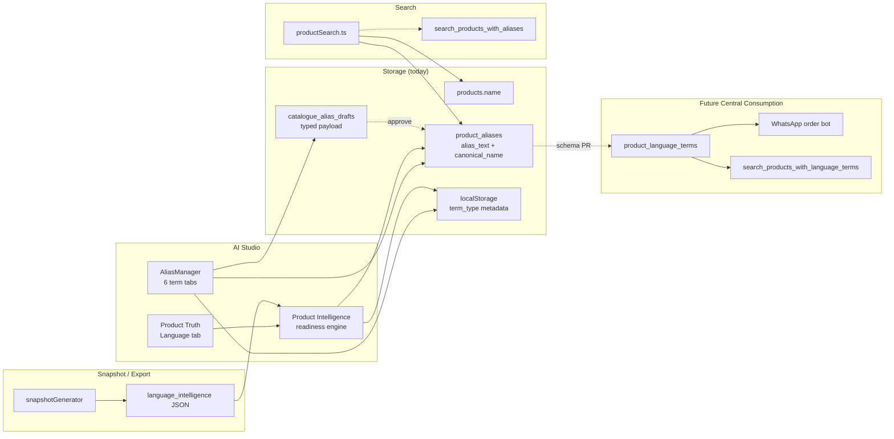

# Product Intelligence Capability Audit

**Date:** 2026-06-10  
**Environment:** Oasis AI Studio → Central Supabase `tcxvcatsqqertcnycuop`  
**Status:** Capability foundation — UI + scoring + snapshot preview wired; Central consumption blocked until schema PR  
**Constraints:** No Central sync enablement · No production data migration · Category 1 imports protected

---

## Executive summary

Product Intelligence is the cross-cutting capability that lets Oasis identify products using **customer language**, **sales language**, and **catalogue language** — ultimately powering Central WhatsApp automation, order-taking, and discovery apps.

**Capability readiness score: 62%** (`foundation_ready`)

| Layer | Score | Status |
|-------|-------|--------|
| Product Language UI (7-class model) | 85% | Shipped — term tabs, drafts, localStorage metadata |
| Product Truth integration | 75% | Language tab, discoverability score, gap list |
| Snapshot / export model | 70% | `language_intelligence` section (read-only preview) |
| Search consumption | 65% | name, sku, alias_text, canonical_name; no typed-term ranking |
| Central WhatsApp consumption | 15% | Blocked — no `product_language_terms` table, no RPC |
| Batch 001 language import | 0% | Authority CSV not promoted (by design) |

---

## A. Current state

### Product Language Authority (seven classes)

| Class | Storage today | AI Studio UI | Central persistence |
|-------|---------------|--------------|---------------------|
| Official Name | `products.name` | Identity tab (editable) | Yes |
| Official Alias | `product_aliases.alias_text` | AliasManager tab | Yes (untyped) |
| Customer Term | UI metadata only | AliasManager tab | No (`term_type` not in DB) |
| WhatsApp Keyword | UI metadata only | AliasManager tab + review notice | No |
| Regional Term | UI metadata only | AliasManager tab | No |
| Legacy Name | `product_aliases` (inferred) | AliasManager tab | Yes (untyped) |
| Search Keyword | UI metadata only | AliasManager tab | No |

**Implemented (PR #34 + this capability PR):**

- `src/features/productLanguage/` — term types, channel scope, draft payloads, localStorage
- `src/components/AliasManager.tsx` — six term-type tabs, admin-safe inserts
- Contributor drafts include `alias_text`, `term_type`, `channel_scope`, `product_id`, `canonical_name`

### Product Truth integration

- **Language tab** in `ProductTruthAdminSection` → `ProductLanguageTermsPanel`
- Loads `product_aliases` rows + resolves term types (UI metadata → inferred)
- **Language discoverability readiness** score (0–5):
  - Has official aliases?
  - Has customer terms?
  - Has WhatsApp keywords?
  - Has search keywords?
  - Has regional terms?
- **Missing discoverability coverage** gap list
- WhatsApp keyword review callout

### Snapshot readiness

`CatalogueSnapshotJson.language_intelligence` (additive, read-only):

```json
{
  "schema_available": false,
  "official_name": "Cashew Kitta",
  "language_readiness": { "score": 2, "maxScore": 5, "percent": 40 },
  "term_counts": { "official_alias": 1, "total_aliases": 1 },
  "terms_preview": [],
  "discoverability_gaps": [],
  "search_consumption": {
    "matches_name": true,
    "matches_sku": true,
    "matches_alias_text": true,
    "matches_canonical_name": true,
    "matches_typed_terms": false
  },
  "note": "Term type is tracked in AI Studio UI only until language-term schema is deployed."
}
```

Central connector payload (`ApprovedCatalogueProductSnapshot`) **unchanged** — language not synced live.

### Search consumption

`src/lib/productSearch.ts`:

| Field | Fallback search | RPC search |
|-------|-----------------|------------|
| `products.name` | Yes | Yes (when RPC deployed) |
| `products.sku` | Yes | Yes |
| `product_aliases.alias_text` | Yes | Depends on RPC column |
| `product_aliases.canonical_name` | Yes (added) | No |
| Typed `term_type` / `channel_scope` | No | No |

### Discoverability scoring

`src/features/productIntelligence/productLanguageReadiness.ts`:

- `evaluateProductLanguageReadiness()` — per-product 5-dimension score
- `capabilityReadinessScore()` — layer score across UI + Truth + snapshot + search

---

## B. Missing wiring

| Gap | Impact | Blocker |
|-----|--------|---------|
| `product_language_terms` table | Typed terms not durable | SQL migration (future PR) |
| PR06C alias approval mapping | `term_type` stripped on approve | SQL + RPC update |
| `search_products_with_language_terms` RPC | No channel-scoped ranking | SQL + pg_trgm |
| Category 2 language import batch | Batch 001 aliases/WhatsApp not in Central | Import PR + approval |
| Central WhatsApp bot connector | Cannot consume keywords | Central app work |
| Product readiness 8-dimension engine | Language not a sync blocker | Intentional — separate score |
| Term counts in Product Truth | Previously localStorage-only | **Fixed** — now loads DB + metadata |

---

## C. Capability map



**Flow:** Contributors propose typed terms → drafts carry full payload → admins approve to flat `product_aliases` (today) → search matches alias text → Product Truth scores discoverability → snapshots export read-only language intelligence → future Central reads typed `product_language_terms` for WhatsApp.

---

## D. Batch 001 assessment (OAS-AS-BKL-0001 … 0025)

**Source:** `data/category1-preview/CATEGORY1_IMPORT_BATCH_001_uploaded.csv` + authority design doc.

| Metric | Value |
|--------|-------|
| SKUs in cohort | 25 |
| Authority aliases expected (sum) | ~190 |
| Authority WhatsApp keywords expected (sum) | ~270 |
| SKUs with disambiguation risk | 3 (0006, 0011, 0019 — shared "pyramid"/"boukaj") |
| Central typed language rows | 0 |
| Category 1 official names imported | Partial (separate import path) |
| Language CSV columns auto-promoted | No (protected) |

### Anchor SKU gaps

| SKU | Official Name | Language gap | Search gap | Discoverability gap |
|-----|---------------|--------------|------------|---------------------|
| OAS-AS-BKL-0001 | Cashew Kitta | 8 aliases + 10 WA keywords in CSV, not imported | RPC missing; fallback only | 0/5 readiness |
| OAS-AS-BKL-0012 | Chocolate Pistachio Asiyah | 9 aliases + 12 WA keywords pending | "asiyah"/"gap" ambiguity | 0/5 readiness |
| OAS-AS-BKL-0019 | Pistachio Pyramid | 7 aliases; conflicts with 0011 | "pyramid" matches multiple SKUs | 0/5 readiness |
| OAS-AS-BKL-0025 | Coconut Durum | 8 aliases + 11 WA keywords pending | "durum" category token | 0/5 readiness |

**Assessment code:** `src/features/productIntelligence/batch001Assessment.ts`

---

## E. Risks

| Risk | Severity | Mitigation |
|------|----------|------------|
| Term type lost on browser clear | Medium | Schema migration P0 |
| Ambiguous keywords ("pyramid", "pista") | High | SKU-anchored terms + specificity scoring |
| Approve RPC drops `term_type` | High | Extend PR06C mapping before bulk import |
| localStorage vs DB count drift | Medium | Product Truth now reads DB; metadata overlay documented |
| Category 1 import overwrite | High | **Protected** — no auto-promote of alias columns |
| Central sync accidental enable | High | `LIVE_CENTRAL_WRITE_ENABLED = false` unchanged |

---

## F. Priority roadmap

### P0 — Required before WhatsApp automation

1. **`product_language_terms` schema** — `term_type`, `channel_scope`, `language`, `script`, `is_active`
2. **Extend `approve_catalogue_alias_draft`** — persist typed fields (or route to new table)
3. **`search_products_with_language_terms` RPC** — channel-scoped, SKU-anchored ranking
4. **Category 2 language import batch** — Batch 001 aliases + WhatsApp from authority CSV (draft-first)

### P1 — Capability hardening

1. Wire language readiness into snapshot **gate** (warn, not block)
2. Product list discoverability badge (score < 3/5)
3. Disambiguation rules for shared tokens (pyramid, pista, durum)
4. Approval inbox — display `term_type` + `channel_scope` from draft payload

### P2 — Central consumption

1. Central WhatsApp keyword sync read API
2. `ApprovedCatalogueProductSnapshot` language_terms[] export
3. Trace bilingual label terms from `regional_term`
4. Customer app search synonym API

---

## G. Recommended next implementation PR

**Title:** `feat(schema): product_language_terms table + approval mapping + typed search RPC`

**Scope:**

- SQL migration for `product_language_terms` (additive)
- Update `approve_catalogue_alias_draft` to insert typed rows
- Deploy `search_products_with_language_terms`
- Migrate UI localStorage term types to DB on first admin save
- Category 2 import staging for Batch 001 language columns (draft-only)

**SQL required?** **YES** (for P0 Central consumption — not in this PR)

---

## H. Validation (this PR)

| Check | Result |
|-------|--------|
| `npm run typecheck` | Run in CI |
| `npm run build` | Run in CI |
| `npm run test` | Includes `productIntelligence.test.ts` |
| No Central sync | Confirmed — `LIVE_CENTRAL_WRITE_ENABLED = false` |
| No SQL / migrations | Confirmed — additive TypeScript + docs only |
| Category 1 protected | Confirmed — no import pipeline changes |

---

## I. Files in this capability PR

| Path | Role |
|------|------|
| `src/features/productIntelligence/types.ts` | Intelligence types |
| `src/features/productIntelligence/languageTermInventory.ts` | DB + metadata inventory |
| `src/features/productIntelligence/productLanguageReadiness.ts` | Discoverability scoring |
| `src/features/productIntelligence/batch001Assessment.ts` | Cohort gap assessment |
| `src/features/productIntelligence/snapshotLanguage.ts` | Snapshot language section builder |
| `src/features/productIntelligence/fetchLanguageTerms.ts` | Async Product Truth loader |
| `src/features/productIntelligence/productIntelligence.test.ts` | Unit tests |
| `src/features/productTruth/panels/ProductLanguageTermsPanel.tsx` | Readiness UI |
| `src/features/catalogueSnapshot/types.ts` | `language_intelligence` field |
| `src/features/catalogueSnapshot/snapshotGenerator.ts` | Snapshot wiring |
| `src/lib/productSearch.ts` | canonical_name in fallback OR |
| `docs/PRODUCT_INTELLIGENCE_CAPABILITY_AUDIT.md` | This document |
