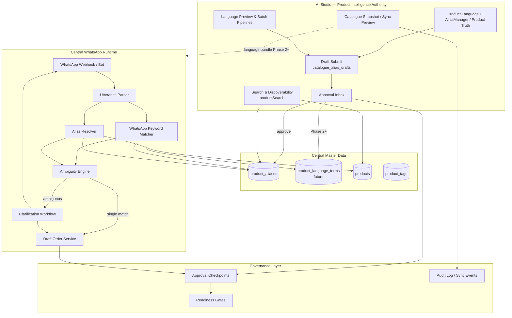
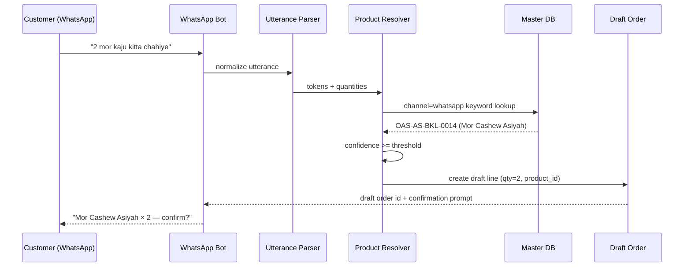
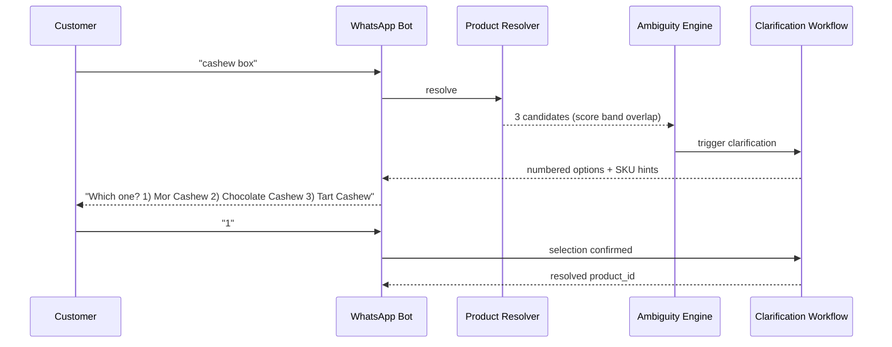
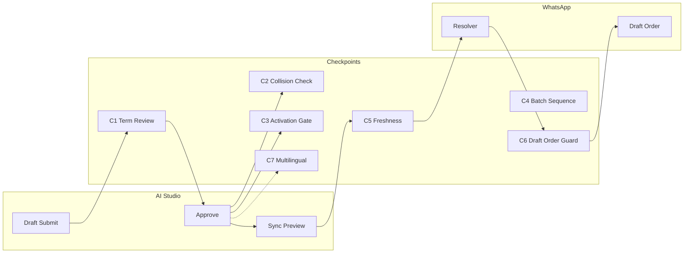

# Product Intelligence → WhatsApp Consumption Blueprint

**Status:** Planning only — no code, SQL, or data changes in this document.  
**Audience:** AI Studio, Oasis Central, WhatsApp order services, governance reviewers.  
**Last updated:** 2026-06-10

---

## 1. Executive summary

This blueprint defines the end-to-end path from **AI Studio Product Intelligence** (language terms, aliases, search authority) to **Central WhatsApp product recognition** (inbound customer utterances → resolved SKU → draft order).

Today, AI Studio has:

- A seven-class Oasis Product Language model (`official_alias`, `customer_term`, `whatsapp_keyword`, `regional_term`, `legacy_name`, `search_keyword`, plus Official Name on `products.name`)
- Contributor draft submission into `catalogue_alias_drafts` with rich payload metadata (`term_type`, `channel_scope`, `language`, `script`, `source`)
- Alias-aware product search (`search_products_with_aliases` RPC + ILIKE fallback)
- Approval inbox workflow (`approve_catalogue_alias_draft` → `product_aliases`)
- Batch 001 Phase 1: **82 anchor drafts** live as `pending_approval` (`source: batch001_language_phase1`) for 4 SKUs

What does **not** exist yet:

- Persisted `term_type` / `channel_scope` on approved master rows
- Channel-scoped search for WhatsApp consumption
- Inbound utterance parsing, ambiguity resolution, or clarification workflow
- Draft order creation from WhatsApp intent
- Language-term bundle in Central sync snapshots
- WhatsApp bot / webhook integration

The program closes these gaps in three phases while preserving draft-gated governance and avoiding premature live Central writes.

---

## 2. Problem statement

WhatsApp order matching requires **reliable, governed product recognition** from informal customer language (Hinglish, transliterations, regional spellings, shorthand). Product Intelligence in AI Studio is the **authority source** for those terms. Central WhatsApp services are the **runtime consumer**.

Without a defined handoff:

| Risk | Impact |
|------|--------|
| Approved aliases lose term-type metadata | WhatsApp keywords indistinguishable from catalogue aliases |
| Flat search across all aliases | False positives from legacy/regional terms in chat |
| No ambiguity protocol | Wrong SKU silently added to orders |
| No governance checkpoints | Unreviewed terms affect customer-facing matching |
| No multilingual model | Arabic/Hindi/Turkish terms cannot be scoped or ranked |

---

## 3. Target architecture

### 3.1 System context



### 3.2 Data flow — happy path



### 3.3 Data flow — ambiguity path



---

## 4. Scope mapping (10 program areas)

| # | Area | Authority (AI Studio) | Consumer (Central WhatsApp) | Current state |
|---|------|----------------------|----------------------------|---------------|
| 1 | Approved language terms | Draft → approve → master | Read approved terms by channel | Drafts exist; metadata not persisted on approve |
| 2 | Product search | `searchProductsWithAliases` | Channel-scoped resolver API | Global alias search only |
| 3 | Alias resolution | `product_aliases` + canonical_name | Token → product_id mapping | Works for catalogue UI, not chat-optimized |
| 4 | WhatsApp keyword resolution | `whatsapp_keyword` term class | Primary chat matching layer | UI + drafts; no runtime API |
| 5 | Customer utterance parsing | Preview / batch intelligence | NLP + quantity extraction | Not built |
| 6 | Ambiguity handling | Conflict preview CSVs | Score bands + candidate caps | Preview-only conflict docs |
| 7 | Clarification workflow | — | Bot UX + session state | Not built |
| 8 | Draft order creation | — | Order draft service | Not built |
| 9 | Governance checkpoints | Approval inbox, readiness gates | Runtime policy enforcement | Partial (draft approval only) |
| 10 | Future multilingual | `language`, `script` in draft payload | Locale-aware ranking | Payload fields exist; not persisted |

---

## 5. Current foundation (as-built)

### 5.1 Product Language model

Source: `src/features/productLanguage/terms.ts`

| Term type | Channel scope | WhatsApp relevance |
|-----------|---------------|-------------------|
| `official_alias` | central, catalogue | Secondary match; catalogue display |
| `whatsapp_keyword` | whatsapp | **Primary** chat recognition |
| `customer_term` | sales, customer_app | Phase 2+ for app/CRM |
| `regional_term` | regional, trace | Phase 3 multilingual |
| `legacy_name` | search, historical | Exclude from WhatsApp default |
| `search_keyword` | search, discovery | Catalogue search only |
| Official Name | `products.name` | Fallback + confirmation display |

**Constraint today:** `TERM_TYPE_UI_NOTICE` — term type is UI/localStorage until language-term schema is deployed. Approve RPC writes only `alias_text`, `canonical_name`, `product_id` to `product_aliases`.

### 5.2 Draft submission path

```
Contributor / batch script
  → catalogue_alias_drafts (pending_approval)
  → ApprovalInbox → approve_catalogue_alias_draft
  → product_aliases (flat row)
```

Batch 001 Phase 1 (live):

| Metric | Value |
|--------|-------|
| SKUs | OAS-AS-BKL-0013, 0014, 0020, 0024 |
| Term types | `official_alias` (32), `whatsapp_keyword` (50) |
| Draft count | 82 `pending_approval` |
| Source tag | `batch001_language_phase1` |
| `product_aliases` | Unchanged until approval |

### 5.3 Search (catalogue)

Source: `src/lib/productSearch.ts`

- RPC: `search_products_with_aliases` (pg_trgm)
- Fallback: ILIKE on `products` + `product_aliases`
- Scoring: SKU > name > alias
- **No channel filter**, no term-type filter

### 5.4 Central sync (preview only)

Source: `src/features/catalogueSnapshot/centralSyncPayload.ts`

- `LIVE_CENTRAL_WRITE_ENABLED = false`
- Snapshots cover identity, UOM, packaging, pricing, media, compliance
- **Language terms not included** in sync payload today

### 5.5 WhatsApp (outbound only in AI Studio)

- `whatsappPreview.ts` — mini-catalogue text generation
- Catalogue share / proposal WhatsApp messages
- **No inbound order matching**

---

## 6. Required schema work

> **Planning only.** No SQL in this blueprint. Schema changes are described for design alignment.

### 6.1 Option A — Extend `product_aliases` (minimal)

Add columns to Central `product_aliases`:

| Column | Type | Purpose |
|--------|------|---------|
| `term_type` | text enum | Distinguish whatsapp_keyword vs official_alias |
| `channel_scope` | text[] | Filter by consumption channel |
| `language` | text | ISO 639-1 (future) |
| `script` | text | Latn / Arab / Deva (future) |
| `source` | text | Provenance (batch001, manual, import) |
| `is_active` | boolean | Soft-disable without delete |
| `match_priority` | int | WhatsApp ranking override |

**Pros:** Single table, approve RPC extension is straightforward.  
**Cons:** Mixes governance classes in one table; harder to version per channel.

### 6.2 Option B — `product_language_terms` (recommended)

New authority table alongside `product_aliases`:

| Column | Purpose |
|--------|---------|
| `id` | PK |
| `product_id` | FK → products |
| `term_text` | Normalized match string |
| `term_type` | Oasis 6-class enum |
| `channel_scope` | text[] |
| `language`, `script` | Multilingual |
| `canonical_name` | Display fallback |
| `source`, `batch_id` | Audit |
| `is_active` | Lifecycle |
| `approved_at`, `approved_by` | Governance |
| `supersedes_id` | Term versioning |

`product_aliases` remains compatibility layer for search RPC during migration.

**Pros:** Clean separation; supports channel-specific indexes; aligns with draft payload shape.  
**Cons:** Requires approve RPC to write both or migrate reads.

### 6.3 WhatsApp runtime tables (Central)

| Table | Purpose |
|-------|-----------|
| `whatsapp_conversation_sessions` | Clarification state, pending selections |
| `whatsapp_utterance_log` | Raw + normalized text, resolver output |
| `whatsapp_resolution_events` | match / ambiguous / failed / clarified |
| `draft_orders` | Pre-confirmation order headers |
| `draft_order_lines` | Resolved product_id, qty, uom, confidence |

### 6.4 Indexes and search primitives

| Index / RPC | Purpose |
|-------------|---------|
| `resolve_whatsapp_product(_utterance, _limit)` | Channel-scoped trigram + keyword priority |
| `GIN(term_text gin_trgm_ops)` on language terms | Fast fuzzy match |
| Partial index `WHERE term_type = 'whatsapp_keyword' AND is_active` | Hot path |
| Materialized view `whatsapp_product_lexicon` | Denormalized SKU + keywords + MOQ snippet |

### 6.5 Schema migration sequencing

1. **Phase 1:** No schema change — use flat `product_aliases`; runtime filters by draft payload audit export
2. **Phase 2:** Deploy `product_language_terms` + extend approve RPC
3. **Phase 3:** Multilingual columns + locale indexes + conversation tables

---

## 7. Required approval workflow

### 7.1 Existing workflow (retain)

| Step | Actor | Action |
|------|-------|--------|
| 1 | Contributor / batch pipeline | Submit `catalogue_alias_drafts` |
| 2 | System | `status = pending_approval` |
| 3 | Reviewer | ApprovalInbox review |
| 4 | Reviewer | `approve_catalogue_alias_draft` |
| 5 | System | INSERT `product_aliases` (+ `product_language_terms` in Phase 2) |

Roles: `catalogue_contributor` (submit), `is_catalogue_reviewer()` (approve), `super_admin` (direct write — avoid for batch imports).

### 7.2 Enhancements for WhatsApp governance

| Checkpoint | When | Rule |
|------------|------|------|
| **C1 — Term class review** | Alias draft approval | Reviewer sees `term_type`, `channel_scope`, `source`, conflict risk |
| **C2 — Cross-product collision** | Before approve | Block if `term_text` already maps to different `product_id` in same channel |
| **C3 — WhatsApp activation gate** | Before runtime consumption | Product must have ≥1 approved `whatsapp_keyword` OR explicit opt-in |
| **C4 — Batch promotion** | Batch 001 phases | Approve anchor SKUs (Phase 1) before expanding to full 25-SKU batch |
| **C5 — Runtime freshness** | WhatsApp resolver | Reject terms older than sync watermark or marked `is_active = false` |
| **C6 — Draft order guard** | Draft order creation | No line item without `confidence >= threshold` or clarification complete |
| **C7 — Multilingual approval** | Phase 3 | Regional terms require script + language metadata before WhatsApp activation |

### 7.3 Approval inbox UX (AI Studio)

Current: alias drafts show generic card. Required:

- Structured alias review panel: term type badge, channel chips, product link, conflict warnings from preview CSV
- Batch filter: `source = batch001_language_phase1`
- Diff view for `update` / `delete_request` operations
- Reject reason codes: `duplicate_term`, `wrong_product`, `unsafe_colloquial`, `needs_regional_review`

### 7.4 Batch 001 approval sequence

| Batch | SKUs | Term types | Prerequisite |
|-------|------|------------|--------------|
| Phase 1 (submitted) | 4 anchor | official_alias, whatsapp_keyword | Approve 82 drafts |
| Phase 2 | Remaining Batch 001 safe | + customer_term, search_keyword | Phase 1 approved + collision check |
| Phase 3 | Review-only terms | regional_term, legacy | Manual linguist review |

---

## 8. Required AI Studio work

### 8.1 Authority & persistence

| Work item | Phase | Description |
|-----------|-------|-------------|
| Language-term schema deployment | 2 | Persist `term_type`, `channel_scope`, `language`, `script` on approve |
| Remove localStorage-only term metadata | 2 | Read/write from master table |
| Extend `approve_catalogue_alias_draft` mapping | 2 | Write `product_language_terms` |
| Batch 001 Phase 2/3 submit scripts | 2–3 | Expand beyond 4 anchor SKUs |
| Import pipeline integration | 2 | Category 1 + language preview → drafts |

### 8.2 Search & discoverability

| Work item | Phase | Description |
|-----------|-------|-------------|
| Channel-scoped search API | 1 | `searchProductsWithAliases({ channel: 'whatsapp' })` |
| Term-type weighted scoring | 2 | Boost `whatsapp_keyword` in WhatsApp context |
| Conflict detection service | 2 | Real-time duplicate term_text across products |
| Discoverability dashboard | 2 | Per-SKU: keyword count, approval %, WhatsApp readiness |

### 8.3 Governance UI

| Work item | Phase | Description |
|-----------|-------|-------------|
| Rich alias approval card | 1 | Term type, channel, source, product preview |
| WhatsApp readiness gate on Product Truth | 1 | Show "ready / blocked" for chat matching |
| Batch approval tools | 2 | Bulk approve filtered drafts with audit |
| Language intelligence in catalogue snapshot | 2 | Include approved terms in sync preview bundle |

### 8.4 Intelligence & preview (no runtime)

| Work item | Phase | Description |
|-----------|-------|-------------|
| Utterance → candidate preview tool | 2 | Admin sandbox: paste chat text, see resolver output |
| Ambiguity report per SKU | 2 | Export overlapping keywords from preview CSV |
| Multilingual term editor | 3 | Script/locale tabs in AliasManager |

### 8.5 Key files to extend (reference)

| Module | Path |
|--------|------|
| Term authority | `src/features/productLanguage/terms.ts` |
| Draft submit | `src/features/catalogueDrafts/draftService.ts` |
| Search | `src/lib/productSearch.ts` |
| Approval UI | `src/features/approvals/ApprovalInbox.tsx` |
| Snapshot sync | `src/features/catalogueSnapshot/centralSyncPayload.ts` |
| Batch submit | `scripts/submit-batch001-language-phase1.mjs` |

---

## 9. Required Central work

### 9.1 WhatsApp runtime services

| Service | Phase | Responsibility |
|---------|-------|----------------|
| Webhook ingress | 1 | Receive messages, session binding |
| Utterance normalizer | 1 | Lowercase, trim, numeral/quantity extraction, Hinglish tokenization |
| Product resolver API | 1 | Channel-scoped lookup against approved terms |
| Ambiguity engine | 2 | Score bands, candidate cap, tie detection |
| Clarification workflow | 2 | Numbered reply, timeout, session persistence |
| Draft order API | 2 | Create/update draft orders from resolved lines |
| Order confirmation bridge | 3 | Promote draft → confirmed order in OMS |

### 9.2 Resolver algorithm (spec)

```
Input: normalized_utterance, customer_id, session_id
Output: ResolutionResult { status, candidates[], confidence, draft_line? }

1. Extract quantity tokens (2, "do", "2kg") → qty_candidates
2. Strip quantities → product_tokens
3. Query whatsapp_keyword matches (exact → trigram)
4. Fallback: official_alias, then products.name/sku
5. Score = keyword_weight × similarity × active_boost
6. If top score - second score < AMBIGUITY_DELTA → ambiguous
7. If top score < MIN_THRESHOLD → unresolved
8. Else → resolved (single product_id)
```

Recommended starting thresholds (tune with Phase 1 anchor data):

| Parameter | Initial value |
|-----------|---------------|
| `MIN_THRESHOLD` | 0.72 |
| `AMBIGUITY_DELTA` | 0.08 |
| `MAX_CANDIDATES` | 3 |
| `whatsapp_keyword weight` | 1.0 |
| `official_alias weight` | 0.85 |
| `legacy_name weight` | 0.0 (excluded) |

### 9.3 Clarification workflow

| State | Bot behavior |
|-------|--------------|
| `resolved` | Confirm product name + qty + MOQ hint |
| `ambiguous` | Present ≤3 numbered options with canonical names |
| `unresolved` | Ask open clarifier; offer catalogue link |
| `awaiting_selection` | Accept 1/2/3 or fuzzy name retry |
| `confirmed` | Write draft order line; ask "add more?" |
| `expired` | Clear session after 30 min idle |

### 9.4 Draft order creation

Minimum draft order line:

| Field | Source |
|-------|--------|
| `product_id` | Resolver |
| `sku` | products.sku |
| `display_name` | products.name |
| `quantity` | Utterance parser |
| `uom` | Default from product MOQ rules |
| `match_confidence` | Resolver score |
| `matched_term` | Winning alias/keyword text |
| `resolution_method` | keyword / alias / sku / clarified |
| `source_channel` | whatsapp |
| `session_id` | Conversation |

Governance: draft orders are **never** auto-promoted to confirmed without explicit customer confirmation (C6).

### 9.5 Central sync consumption

When `LIVE_CENTRAL_WRITE_ENABLED` is eventually true:

- AI Studio publishes `language_intelligence` bundle in catalogue snapshot
- Central materializes `whatsapp_product_lexicon` on sync event
- WhatsApp resolver reads from materialized lexicon, not AI Studio directly

Until then: Central reads `product_aliases` / `product_language_terms` directly from shared Supabase.

---

## 10. Phase implementation plan

### Phase 1 — Anchor recognition (approve + resolve)

**Goal:** Four anchor SKUs recognizable in WhatsApp from approved keywords.

| Track | Deliverables |
|-------|-------------|
| **Governance** | Approve 82 Batch 001 Phase 1 drafts (C1, C4) |
| **AI Studio** | Rich alias approval card; WhatsApp readiness indicator; channel-scoped search prototype |
| **Schema** | None required (flat `product_aliases`) |
| **Central** | Webhook stub; normalizer; resolver reading `product_aliases` with hardcoded anchor SKU allowlist |
| **Validation** | 20+ utterance test cases per anchor SKU; 0 silent wrong-SKU matches |

**Exit criteria:**

- [ ] 82 drafts approved → ~82 new `product_aliases` rows
- [ ] Resolver returns correct product_id for ≥90% Phase 1 test utterances
- [ ] Ambiguous cases return `ambiguous`, not wrong product
- [ ] No draft orders created without confirmation step

**Batch 001 anchor products:**

| SKU | Product | Keywords (approved target) |
|-----|---------|---------------------------|
| OAS-AS-BKL-0014 | Mor Cashew Asiyah | mor kaju, cashew kitta, … |
| OAS-AS-BKL-0024 | Mor Pistachio Durum | mor pista, … |
| OAS-AS-BKL-0013 | Chocolate Cashew Asiyah | chocolate kaju, … |
| OAS-AS-BKL-0020 | Tart Cashew | tart kaju, … |

---

### Phase 2 — Full Batch 001 + ambiguity + draft orders

**Goal:** All 25 Batch 001 SKUs; production clarification flow; draft order creation.

| Track | Deliverables |
|-------|-------------|
| **Governance** | Phase 2 batch submit (safe customer_term, search_keyword); collision checks (C2); activation gates (C3) |
| **AI Studio** | `product_language_terms` schema; extended approve RPC; language bundle in sync preview; utterance preview sandbox |
| **Schema** | `product_language_terms`; `whatsapp_*` session/log tables; `draft_orders` |
| **Central** | Full resolver API; ambiguity engine; clarification workflow; draft order service |
| **Validation** | End-to-end: message → clarify → draft order → confirmation |

**Exit criteria:**

- [ ] ≥541 safe-to-draft terms approved across Batch 001
- [ ] Term-type metadata persisted and channel-filterable
- [ ] Clarification workflow handles ≥95% ambiguous test cases
- [ ] Draft orders created with full audit trail
- [ ] Approval inbox supports batch filters and conflict warnings

---

### Phase 3 — Multilingual + production scale

**Goal:** Arabic/Hindi/Turkish regional terms; production OMS bridge; continuous governance.

| Track | Deliverables |
|-------|-------------|
| **Governance** | Regional term linguist review (C7); review-only CSV promotion process |
| **AI Studio** | Multilingual term editor; script/locale filters; discoverability scoring in Product Truth |
| **Schema** | Locale indexes; `supersedes_id` term versioning; multilingual match_priority |
| **Central** | Locale-aware ranking; RTL message templates; order promotion to OMS; analytics on resolution_events |
| **Validation** | Per-locale utterance suites; regression on Phase 1/2 anchors |

**Exit criteria:**

- [ ] Regional terms approved with language/script metadata
- [ ] Resolver supports locale hint from customer profile or script detection
- [ ] Live Central sync includes language intelligence bundle
- [ ] Resolution analytics dashboard (match rate, ambiguity rate, clarification conversion)

---

## 11. Governance checkpoint summary



| ID | Name | Phase | Blocks |
|----|------|-------|--------|
| C1 | Term class review | 1 | Unreviewed drafts → runtime |
| C2 | Cross-product collision | 2 | Approve conflicting term_text |
| C3 | WhatsApp activation gate | 2 | Products without keywords → resolver |
| C4 | Batch sequence | 1–2 | Phase 2 before Phase 1 anchors stable |
| C5 | Runtime freshness | 2 | Stale/deactivated terms |
| C6 | Draft order guard | 2 | Low-confidence auto-lines |
| C7 | Multilingual approval | 3 | Regional terms without script |

---

## 12. Future multilingual support

### 12.1 Language model

| Dimension | Phase 1 | Phase 3 |
|-----------|---------|---------|
| Scripts | Latin transliterations (kaju, pista) | Arabic, Devanagari, Turkish |
| Locale ranking | Single global list | `language` + `script` weighted |
| Customer hint | None | Profile locale, keyboard detection |
| Fallback | English canonical name | Official Name → official_alias |

### 12.2 Data requirements

- `language` (ISO 639-1): `hi`, `ar`, `tr`, `en`
- `script` (ISO 15924): `Latn`, `Arab`, `Deva`
- `match_priority` per channel/locale
- Review-only terms (`batch001_language_terms_review_only.csv`) require linguist sign-off before WhatsApp activation

### 12.3 Resolver extensions

1. Detect script in utterance (Unicode range heuristics)
2. Filter candidate terms by `script` + `language`
3. Cross-script fallback: transliteration map (kaju ↔ काजू)
4. Clarification messages in customer language template

---

## 13. Dependencies and risks

| Dependency | Risk | Mitigation |
|------------|------|------------|
| Phase 1 approval backlog | Runtime has no keywords | Prioritize anchor SKU approval in inbox |
| Flat `product_aliases` in Phase 1 | Cannot filter whatsapp-only | Export payload `source` + manual allowlist; deploy schema in Phase 2 |
| `LIVE_CENTRAL_WRITE_ENABLED = false` | No snapshot-based handoff | Direct DB read from shared Supabase until sync live |
| Cross-product keyword collision | Wrong SKU match | C2 collision check + ambiguity workflow |
| Hinglish variability | Low confidence | Expand whatsapp_keyword coverage; clarification UX |
| Approval inbox UX gap | Reviewer fatigue / errors | Rich cards + batch filters |

---

## 14. Success metrics

| Metric | Phase 1 target | Phase 2 target | Phase 3 target |
|--------|----------------|----------------|----------------|
| Approved whatsapp_keywords (anchor / full batch) | 50 / 50 | 200+ / 400+ | Full batch |
| Resolver precision (correct single match) | ≥90% | ≥92% | ≥95% |
| Silent wrong-SKU rate | 0% | <0.5% | <0.2% |
| Ambiguity clarification completion | N/A | ≥80% | ≥90% |
| Draft order confirmation rate | N/A | ≥70% | ≥85% |
| Median resolution latency | <500ms | <300ms | <200ms |

---

## 15. Out of scope (this program)

- Trace regional fulfillment integration (separate channel scope)
- Customer app search (uses `customer_term` — parallel track)
- Live Central product sync enablement (prerequisite program)
- Payment / invoicing on WhatsApp
- AI-generated keyword suggestions without human approval

---

## 16. Immediate next actions

| Priority | Owner | Action |
|----------|-------|--------|
| P0 | Governance | Review and approve 82 Phase 1 `catalogue_alias_drafts` |
| P0 | AI Studio | Rich alias approval card (term type, channel, source) |
| P1 | Central | Utterance normalizer + anchor SKU resolver prototype |
| P1 | AI Studio | Channel-scoped search in `productSearch.ts` |
| P2 | Platform | Design `product_language_terms` schema (PR-06C1b+) |
| P2 | Central | Ambiguity + clarification workflow |
| P3 | Joint | Language bundle in catalogue snapshot sync preview |

---

## 17. Related documents

| Document | Path |
|----------|------|
| Draft approval architecture | `docs/DRAFT_APPROVAL_ARCHITECTURE.md` |
| Approval mapping (Central) | `docs/PR06C_APPROVAL_MAPPING.md` |
| Central sync report | `docs/AI_STUDIO_VERSIONED_SNAPSHOT_CENTRAL_SYNC_REPORT.md` |
| Catalogue authority audit | `docs/AI_STUDIO_CATALOGUE_AUTHORITY_AUDIT.md` |
| Batch 001 safe-to-draft CSV | `data/product-language-preview/batch001_language_terms_safe_to_draft.csv` |
| Phase 1 submit script | `scripts/submit-batch001-language-phase1.mjs` |
| Product language terms module | `src/features/productLanguage/terms.ts` |

---

*This blueprint is planning-only. Implementation PRs should reference the relevant phase and checkpoint IDs (C1–C7).*
